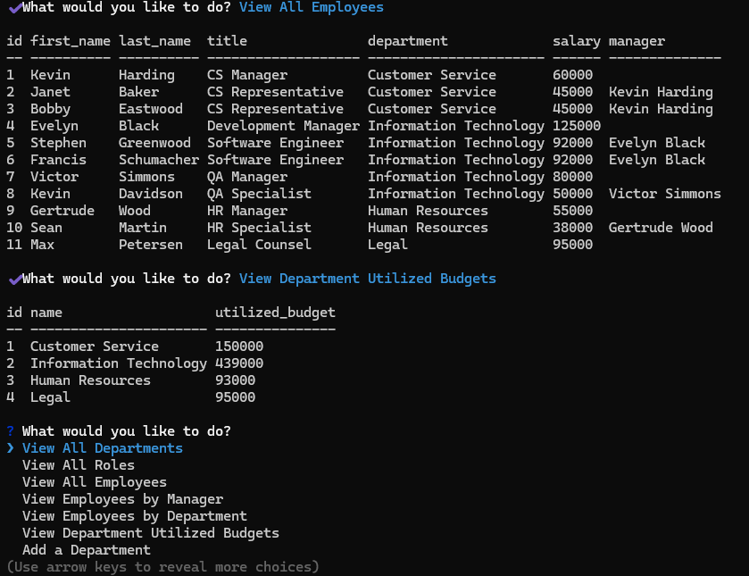

# EmployeeTracker

A command-line application for managing an employee database. Departments and roles can be created and managed along with salaries and optional managers.

## Table of Contents

- [Prerequisites](#prerequisites)
- [Installation](#installation)
- [Usage](#usage)
- [License](#license)
- [Questions](#questions)
- [Demo](#demo)

## Prerequisites

A PostgreSQL database is required to run the application. The `schema.sql` file for creating the database structure can be found in the db folder, along with an optional `seeds.sql` file which can be used to fill the DB with sample data for testing purposes.

Assuming Postgres has been installed, you can execute the following commands from the repo folder after cloning to construct the database:

`psql -U <username>` (default user is postgres; you will be asked to provide your admin password) 
`\i db/schema.sql` 
`\i db/seeds.sql` (optional; use only if test data is required) 
`\q`

## Installation

From the repo folder, run `npm ci` to install dependencies.

You will also need to specify your DB and login credentials in a `.env` file in the before running the application (see the `.env.EXAMPLE` file for formatting).

## Usage

After setting up the database and configuring credentials, type `npm start` at the command line to start the program. You'll then be able to respond to the prompts to view the existing departments, roles and employees, or to create and update data in the database.

## License

This project is governed by The MIT License. For more information, click or tap on the badge below.

## Questions

I can be reached with questions at https://www.github.com/Prelle or via email at p.elayne.terry@gmail.com.

## Demo

